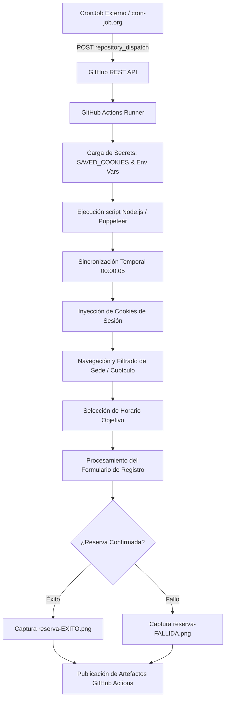

# Sistema Automatizado de Reservas de Cubículos

> [!IMPORTANT]
> **Aviso de Uso Educativo y Personal**
> Este proyecto ha sido desarrollado exclusivamente con fines **educativos, de investigación y automatización personal** para optimizar la gestión de horarios en reservas de cubículos universitarios. 
> 
> El repositorio demuestra patrones avanzados de arquitectura *Serverless*, orquestación de tareas en la nube mediante Webhooks, sincronización temporal de alta precisión y reutilización segura de sesiones autenticadas por el propio usuario (Session Injection vía cookies). **No contiene credenciales ni secretos en su historial de versiones** y no promueve la vulneración no autorizada de sistemas informáticos.

Desarrollo en **Node.js** utilizando **Puppeteer Stealth** para la automatización programada de reservas de cubículos de la sede San Miguel (UPC). Diseñado para ejecutarse en entorno *Serverless* mediante **GitHub Actions**, optimizando el manejo de renderizado en navegador headless, sincronización precisa de husos horarios y reutilización eficiente de sesión.

---

## Arquitectura y Diagrama de Flujo



---

## Características Principales

* **Timer de Alta Precisión:** Algoritmo de sincronización que calcula la diferencia horaria con la zona `America/Lima` para hibernar el proceso y gatillar la interacción exactamente en la ventana de habilitación (`00:00:05`).
* **Session Injection (Reutilización de Sesión):** Inyección de cookies de sesión extraídas localmente tras la autenticación de dos factores (2FA), permitiendo la ejecución desatendida en entornos CI/CD sin exponer credenciales activas.
* **Disparo Externo mediante Webhook:** Integración con `repository_dispatch` para omitir latencias y colas globales de baja prioridad en programaciones `cron` nativas de GitHub Actions.

---

## Configuración del Entorno Local

1. **Instalar dependencias:**
   ```bash
   npm install
   ```

2. **Configurar variables de entorno:**
   Copiar `.env.example` a `.env` e ingresar las variables necesarias:
   ```bash
   cp .env.example .env
   ```

3. **Generar cookies de sesión (Autenticación inicial):**
   Ejecutar el script generador para abrir Chromium localmente, iniciar sesión y aprobar la verificación de dos factores (2FA) en tu dispositivo móvil. Las cookies se exportarán a `cookies.json`:
   ```bash
   node generate-cookies.js
   ```

4. **Despliegue en GitHub Actions:**
   Ir a **Settings** (del repositorio) > **Secrets and variables** > **Actions** y crear los siguientes *Repository Secrets*:
   - `UPC_CORREO` y `UPC_PASSWORD`
   - `COMPANERO_NOMBRE` y `COMPANERO_CODIGO`
   - `HORA_INICIO` (ej. `20:00`) y `HORA_FIN` (ej. `22:00`)
   - `SAVED_COOKIES` (Copiar y pegar todo el contenido JSON generado en `cookies.json`).

5. **Configuración del Cronjob Externo (Webhooks):**
   - Generar un **Personal Access Token (Classic)** en GitHub marcando el scope `repo`.
   - Registrar una cuenta en [cron-job.org](https://cron-job.org).
   - Crear un nuevo Job apuntando a:
     ```http
     POST https://api.github.com/repos/TU_USUARIO/REPOSITORIO/dispatches
     ```
   - **Headers requeridos:**
     - `Accept: application/vnd.github.v3+json`
     - `User-Agent: CronJob`
     - `Authorization: Bearer <TU_GITHUB_TOKEN>`
   - **Body (JSON):**
     ```json
     { "event_type": "trigger_reserva" }
     ```
   - Configurar la programación para ejecutarse 5 minutos antes de la ventana de apertura del sistema objetivo.